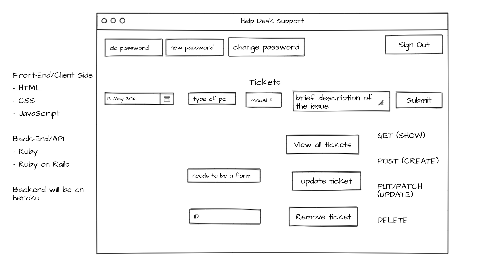

# **Project 2: Help Desk Support (client side)**

This part of project 2 will be the client side.

# **Description**
For the second project, I am plannig on doing a tech support site where the user can create a ticket if they are experiencing an issue with thier pc. When the user is on the 'main page/login page', they should be able to only see the sign-up and sign-in form. The user can then sign up if they don't have an account and then sign in. If they are a returning user then they can just sign in. Once they're logged in, the user should then be able see the 'ticket page' and see the create ticket form, update a ticket, view all tickets, remove a ticket, change password form and the sign out button. They can then create a ticket where they would need to input the type of computer they have, the model number, the date they are creating the ticket and a breif description of the issue they are having. After creating the ticket, the user should be able to see all the tickets they have created or if they just want to see one ticket they should be able to do that as well. They can then update the ticket and/or remove a ticket too. The user should be able to change their password and sign out successfully as well.

I created another resource called Hardware where the user can create a hardware for thier pc, update the hardware, view all the hardware they've created and delete a hardware as well. When the user is logged in, they should be able to see all of the following forms: create a hardware, update a hardware, view all hardware and delete a hardware. When the user creates a hardware they will need to input the date they are creating the hardware, the name of the hardare, the processor speed, memory and the serial number. When updating the hardware, they can also update the same fields (the date, the name of the hardware, the name of the hardare, the processor speed, memory and the serial number).

# **User Stories For Ticket**

- As a user I want to be able to sign up and sign in successfully.

- As a user, I want to be able to see the change password form and sign out button once I have logged in.

- As a user, I want to be able to see the form in which I can submit a ticket.

- As a user, I want to be able to see all the tickets I've created.

- As a user, I want to be able to update and/or remove a ticket.

- As a user, when I signout, I shouldn't see all tickets.

- A a user I want to be able to change the password and sign out successfully.

# **User Stories For Hardware**

- As a user I want to be able to sign up and sign in successfully.

- As a user, I want to be able to see the change password form and sign out button once I have logged in.

- As a user, I want to be able to see the form in which I can create a hardware.

- As a user, I want to be able to see all the hardware I've created.

- As a user, I want to be able to update and/or remove a hardware.

- As a user, when I signout, I shouldn't see all hardware.

- A a user I want to be able to change the password and sign out successfully.

# **Technologies Used**
- HTML
- CSS
- JavaScript
- JQuery
- Bootstrap

# **Unsolved Issues/Future**
- One issue that I had was being able to display all the tickets in a modal. I've made a few attempts in doing so but kept breaking my code so I thought it would be best to leave it alone for now and give it a try later on.

- One thing that I would like to add later on as well is being able to display one ticket to the user and not just all of them at once. I would also like to add a third API like displaying the weather or time to the user.

- I would like to make the app responsive where users can view it on thier phones with no issues. I would also like to have success messages display in a manner where they don't have to scroll all the way up to see if they created a resource successfully or not, if they were able to update it successfully or not, etc.

# **API Repository**
- Link to the API repo: [API Repository](https://github.com/Nancy4510/project2_api)

- Link to the client repo: [Client Repository](https://github.com/Nancy4510/project2_client)

- Link to the deployed back-end: [Deployed Back-End](https://peaceful-cove-13394.herokuapp.com)

- Link to the deployed site: [Help Desk Support](https://nancy4510.github.io/project2_client/)

# **Wireframe**
**Wireframe to Front-End**

**Ticket Section:**

**Hardware Section:**

